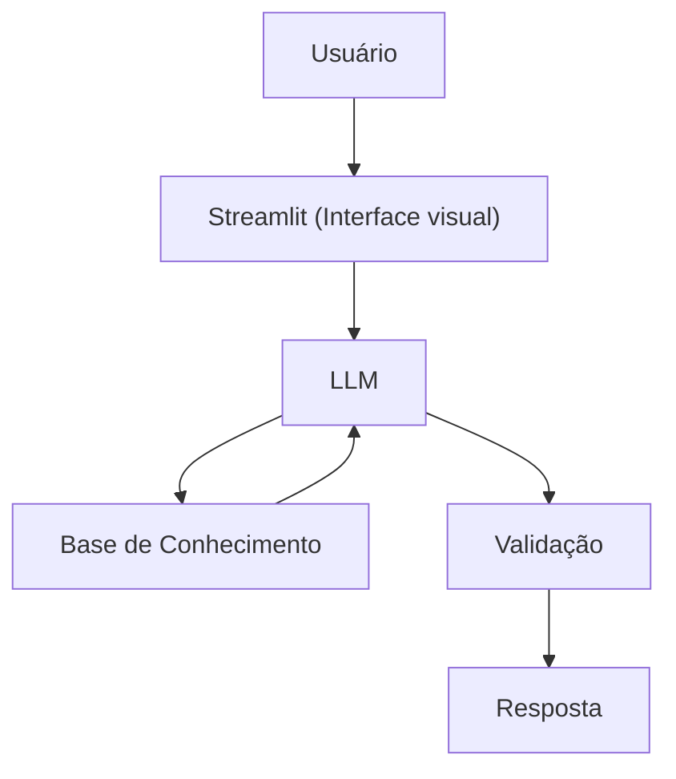

# 💰 Edu — Educador Financeiro Inteligente

> Agente financeiro conversacional com IA Generativa, desenvolvido como solução para o Lab **"Bia do Futuro"** da [DIO](https://www.dio.me/).

---

## 🧠 Sobre o Projeto

O **Edu** é um educador financeiro que explica conceitos de finanças pessoais de forma simples e personalizada, usando os dados do próprio cliente como exemplos práticos — como um professor particular disponível 24h.

Ele **não recomenda investimentos**. Apenas educa. E o melhor: roda **100% local**, sem custo e sem enviar dados para ninguém.

> *"62% dos brasileiros não sabem o que é reserva de emergência. Muita gente quer aprender sobre finanças, mas não sabe por onde começar."*

---

## 🏗️ Arquitetura



| Componente | Descrição |
|---|---|
| Interface | [Streamlit](https://streamlit.io) |
| LLM | Ollama — `gpt-oss:20b-cloud` (local) |
| Base de Conhecimento | JSON/CSV mockados na pasta `data/` |

---

## ✨ Funcionalidades

- 📊 **Análise de gastos** — identifica padrões nas transações do cliente e usa como exemplos didáticos
- 🎯 **Apoio a metas** — contextualiza as explicações com os objetivos reais do usuário (reserva de emergência, entrada do apartamento)
- 📚 **Educação sobre produtos** — explica Tesouro Selic, CDB, LCI/LCA, FIIs e Fundo de Ações de forma acessível
- 🔒 **Anti-alucinação** — só usa dados do contexto, admite limitações e nunca inventa informações

---

## 🤖 Persona do Edu

- **Nome:** Edu (Educador Financeiro)
- **Tom:** Informal, didático e paciente — como um professor particular
- **Saudação:** *"Oi! Sou o Edu, seu educador financeiro. Como posso te ajudar a aprender hoje?"*

### Regras de comportamento (System Prompt):
- **Nunca** recomenda investimentos específicos — apenas explica como funcionam
- Usa os dados do cliente como exemplos práticos e personalizados
- Linguagem simples, como se explicasse para um amigo
- Respostas sucintas — no máximo 3 parágrafos
- Sempre verifica se o usuário entendeu
- Fora do tema de finanças? O Edu lembra educadamente o seu papel

### O que o Edu NÃO faz:
- ❌ Recomenda onde investir
- ❌ Acessa dados bancários sensíveis
- ❌ Substitui um profissional certificado

---

## 🗂️ Base de Conhecimento

| Arquivo | Formato | Uso no Edu |
|---|---|---|
| `perfil_investidor.json` | JSON | Personaliza explicações com o perfil e metas do cliente |
| `transacoes.csv` | CSV | Analisa padrão de gastos para exemplos didáticos |
| `historico_atendimento.csv` | CSV | Dá continuidade ao atendimento com contexto histórico |
| `produtos_financeiros.json` | JSON | Lista os produtos disponíveis para serem ensinados |

> Os dados foram adaptados em relação ao template original: o **Fundo Imobiliário (FII)** substituiu o Fundo Multimercado, para garantir maior assertividade na validação das respostas do Edu.

---

## 📁 Estrutura do Repositório

```
📁 dio-lab-bia-do-futuro/
├── 📄 README.md
├── 📁 data/
│   ├── transacoes.csv
│   ├── historico_atendimento.csv
│   ├── perfil_investidor.json
│   └── produtos_financeiros.json
├── 📁 docs/
│   ├── 01-documentacao-agente.md
│   ├── 02-base-conhecimento.md
│   ├── 03-prompts.md
│   ├── 04-metricas.md
│   └── 05-pitch.md
├── 📁 src/
│   └── app.py
├── 📁 assets/
└── 📁 examples/
```

---

## 🚀 Como Executar

**Pré-requisitos:** Python 3.10+, [Ollama](https://ollama.ai/) instalado e rodando localmente.

```bash
# 1. Clone o repositório
git clone https://github.com/Tutucr77/dio-lab-bia-do-futuro.git
cd dio-lab-bia-do-futuro

# 2. Instale as dependências
pip install streamlit pandas requests

# 3. Suba o modelo no Ollama
ollama run gpt-oss:20b-cloud

# 4. Execute a aplicação
streamlit run src/app.py
```

Acesse em: `http://localhost:8501`

---

## 💬 Exemplos de Interação

**Pergunta sobre conceito**
> 👤 "O que é CDI?"
> 🤖 *"CDI é uma taxa de referência usada pelos bancos. Quando um investimento rende '100% do CDI', significa que ele acompanha essa taxa. Quer que eu explique a diferença entre CDI e Selic?"*

**Análise de gastos**
> 👤 "Onde estou gastando mais?"
> 🤖 *"Olhando suas transações de outubro, sua maior despesa é moradia (R$ 1.380), seguida de alimentação (R$ 570). Juntas, representam quase 80% dos seus gastos. Quer que eu explique algumas estratégias de organização?"*

**Tentativa de recomendação**
> 👤 "Devo investir em ações?"
> 🤖 *"Não posso te dizer se você deve, mas posso explicar como funciona! Ações são pedaços de empresas — você vira sócio. O risco é alto porque o preço varia muito. Quer saber mais sobre risco?"*

---
